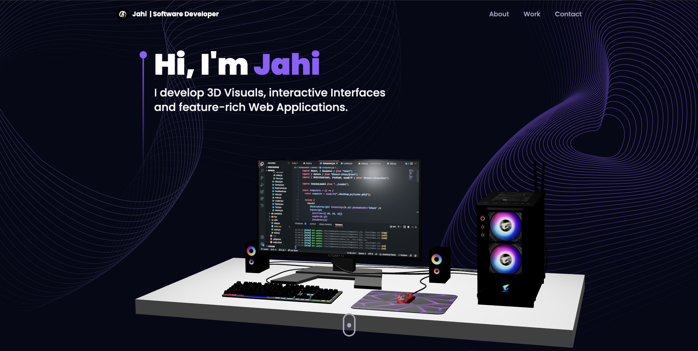
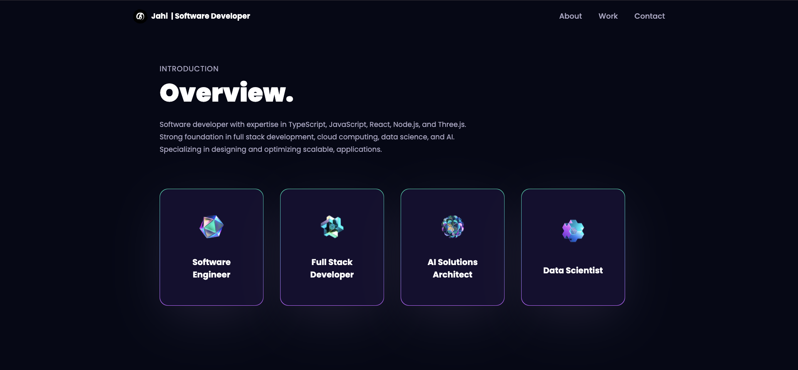
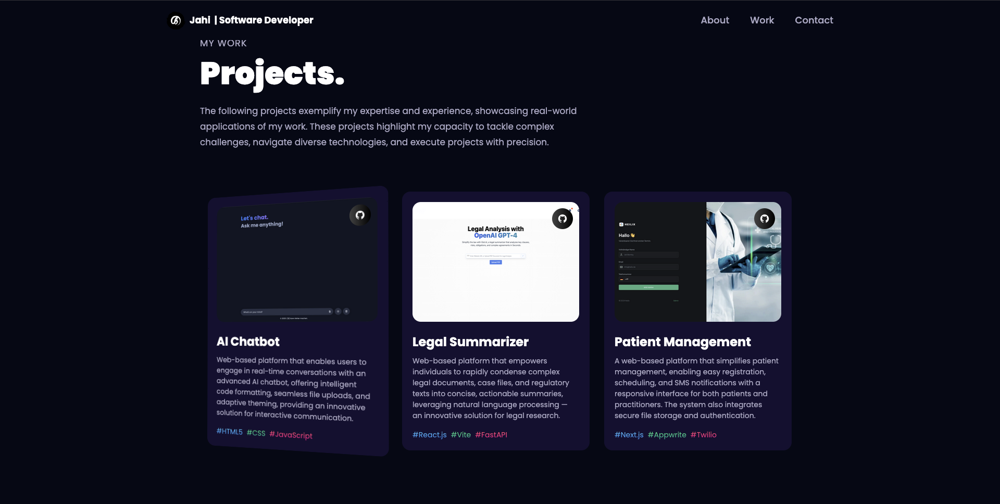
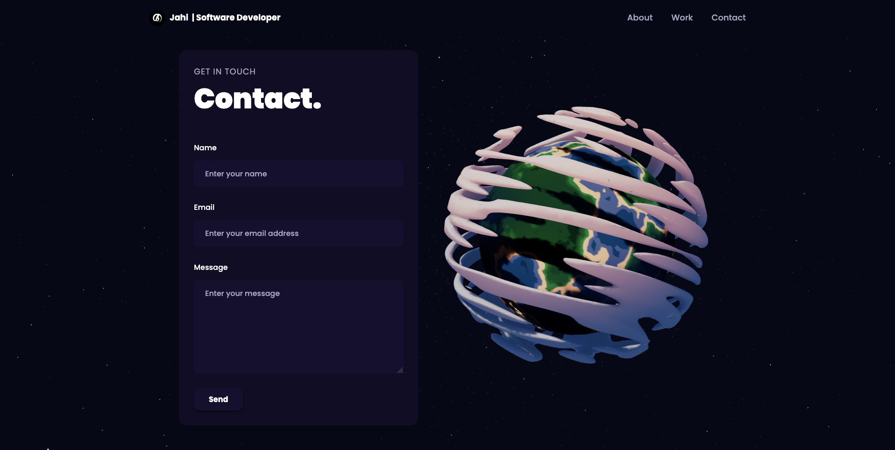

<div align="center">
  <h1>Developer Portfolio</h1>
  <p><strong>This project is a 3D interactive developer portfolio built using React.js, Three.js, and Tailwind CSS.</strong></p>

  [](https://www.typescriptlang.org/)
  [](https://reactjs.org/)
  [](https://tailwindcss.com/)
  [](https://vitejs.dev/)
  [](LICENSE)
</div>

--- 

## 🚀 Welcome to the Future of Interactive Portfolios

This project is not just a website; it’s a cutting-edge 3D powered portfolio platform designed to captivate and engage visitors like never before. By combining immersive 3D models, seamless animations, and intuitive interactivity, it showcases skills, projects, and testimonials in a visually stunning way. Built with React.js, Three.js, React Three Fiber, and Framer Motion, this platform offers a truly unique digital presence — perfect for creatives, developers, and innovators who want to stand out.

<br>






---

## 🔋 Features

## Features

- **Customizable 3D Hero Section**  
  A detailed 3D desktop model that can be easily customized to fit your personal or brand style.

- **Interactive Experience and Work Sections**  
  Engaging, animated sections powered by Framer Motion to showcase your experience and projects dynamically.

- **3D Skills Showcase**  
  Skill sets displayed using captivating 3D geometries, leveraging Three.js and React Three Fiber for a unique presentation.

- **Animated Projects and Testimonials**  
  Smoothly animated projects and client testimonials, enhancing credibility and visual appeal.

- **Contact Section with 3D Earth Model**  
  An interactive 3D Earth combined with a fully functional contact form powered by EmailJS for seamless communication.

- **Dynamic 3D Stars Background**  
  Progressive generation of stars at random positions using Three.js to add depth and ambiance.

- **Consistent and Cohesive Animations**  
  Site-wide animations implemented with Framer Motion for a polished and professional feel.

- **Responsive Design**  
  Fully responsive layout ensuring optimal usability across desktop, tablet, and mobile devices.

- **Clean and Modular Codebase**  
  Well-structured, reusable components designed for scalability and easy maintenance.

## 🤸 Quick Start

### Prerequisites

Ensure you have the following installed on your machine:

- [Git](https://git-scm.com/)
- [Node.js](https://nodejs.org/en)
- [npm](https://www.npmjs.com/) (Node Package Manager)

### Cloning the Repository

```bash
git clone git@github.com/sjbentley/3D-Portfolio.git
cd 3D-Portfolio
```

### Installation

Install the project dependencies using npm:

```bash
npm install
```

### Set Up Environment Variables

Create a new file named `.env` in the root of your project and add the following content:

```env
REACT_APP_EMAILJS_USERID=your_emailjs_user_id
REACT_APP_EMAILJS_TEMPLATEID=your_emailjs_template_id
REACT_APP_EMAILJS_RECEIVERID=your_emailjs_receiver_id
```

Replace the placeholder values with your actual EmailJS credentials. You can obtain these credentials by signing up on the [EmailJS website](https://www.emailjs.com/).

### Running the Project

```bash
npm run dev
```

Open [http://localhost:5173](http://localhost:5173) in your browser to view the project.

## 🕸️ Snippets

Key snippets from the project will be added here.

## 🔗 Links

- [Project Demo](#) *(Coming Soon)*

## 🚀 More

For further questions or feature requests, open an issue in the repository. 🚀

## License

This project is licensed under the MIT License.

---

[Linktr.ee](https://linktr.ee/sirjahibentley) • [Tiktok](https://tiktok.com/@sirjahibentley) • [Instagram](https://instagram.com/sirjahibentley) • [Facebook](https://facebook.com/sirjahibentley)
